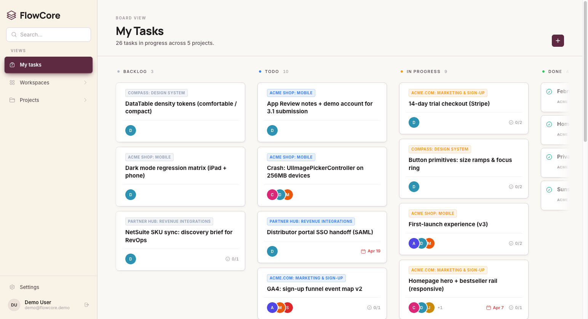
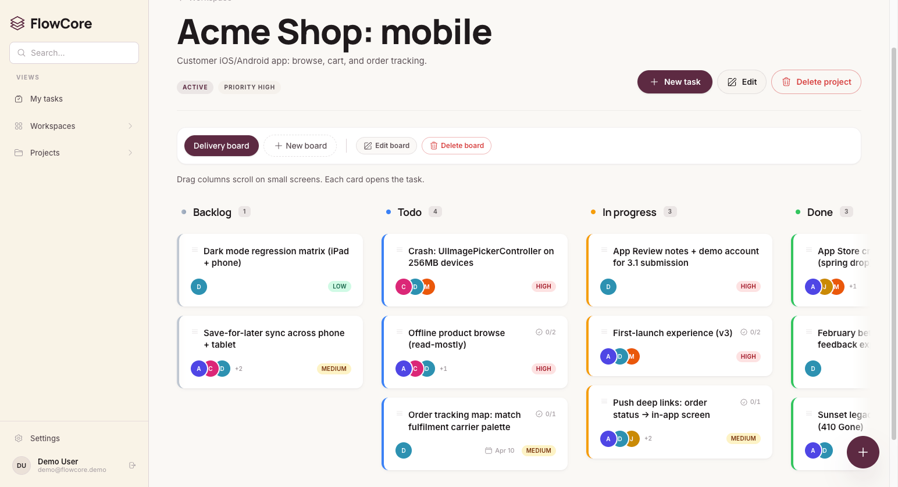
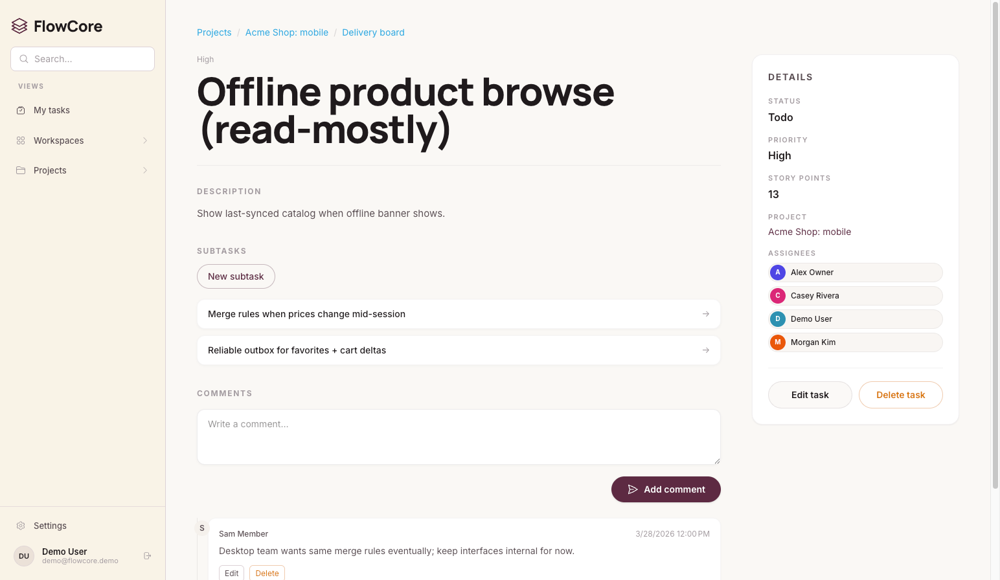
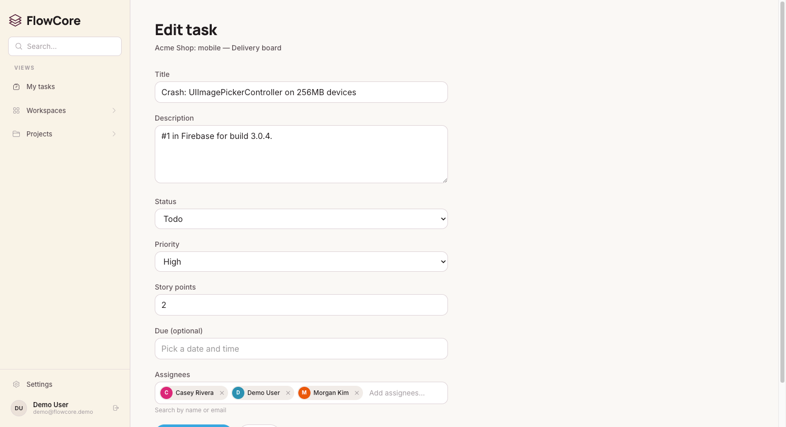

# FlowCore

FlowCore is a backend-focused full-stack project management app with a clear **workspace -> project -> board -> task** hierarchy.

**Tech stack:** **ASP.NET Core MVC (.NET 10)**, **EF Core 10**, **PostgreSQL 18**, **Tailwind 4**.

## Why this project stands out

- Built with a clean backend architecture: **Controller -> Service -> Repository -> DbContext**.
- Uses production-minded patterns: **`Result<T>` flow**, explicit cascade rules, and async-first data access.
- Includes a Tailwind UI and realistic seeded data so reviewers can evaluate full user flows quickly.

## Screenshots






## Run locally

### Prerequisites

- **.NET 10 SDK**
- **Node.js + npm** (needed for Tailwind CSS build)
- **Docker** (or a local PostgreSQL instance)

### 1) Start PostgreSQL (Docker)

```bash
docker run -d --name flowcore-pg -p 5432:5432 -e POSTGRES_PASSWORD=postgres -e POSTGRES_DB=FlowCore postgres:18
```

### 2) Install frontend dependencies

```bash
npm install
```

### 3) Apply migrations

```bash
dotnet ef database update --project FlowCore --startup-project FlowCore --context FlowCoreDbContext
```

### 4) Run the app

```bash
dotnet run --project FlowCore
```

Open the local URL printed by Kestrel.

## Demo accounts (seeded)

On first run in `Development`, the app seeds demo users/projects/tasks.

- Emails: `alex@flowcore.demo`, `sam@flowcore.demo`, `casey@flowcore.demo`, `jordan@flowcore.demo`, `morgan@flowcore.demo`
- Password: `Seed__SharedPassword` if configured, otherwise local fallback `Admin6060!`

## Code highlights

If someone wants to inspect code quality quickly:

- [`FlowCore/Data/FlowCoreDbContext.cs`](FlowCore/Data/FlowCoreDbContext.cs)
- [`FlowCore/Common/Result.cs`](FlowCore/Common/Result.cs)
- [`FlowCore/Services/Domain/TaskService.cs`](FlowCore/Services/Domain/TaskService.cs)
- [`FlowCore/Repositories/EntityFramework/EfTaskRepository.cs`](FlowCore/Repositories/EntityFramework/EfTaskRepository.cs)
