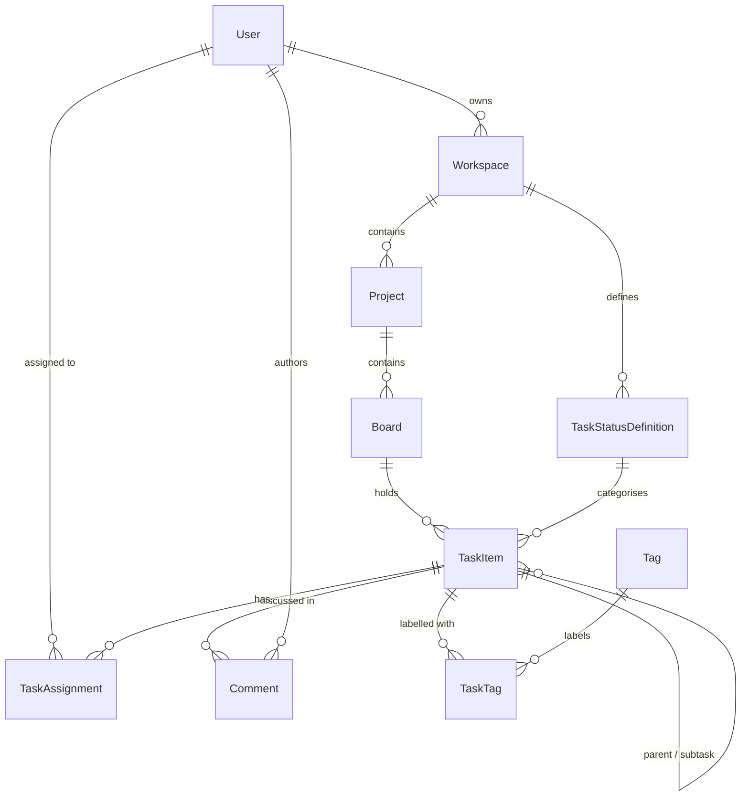

# FlowCore — Semantic data model

FlowCore models project work as a hierarchy: **users** own **workspaces**, which contain **projects**, which contain **boards**, which hold **tasks**. Tasks can be assigned to users, tagged, commented on, and broken into subtasks. Each workspace owns its own set of task statuses (e.g. Backlog → In Progress → Done), so the workflow is configurable per workspace. The persistence stack is EF Core 10 on Postgres; relationships and cascade behaviour are configured via the Fluent API in [`FlowCoreDbContext.OnModelCreating`](../FlowCore/Data/FlowCoreDbContext.cs).

## Entity-relationship diagram

Ten tables in total — eight aggregate roots/entities plus two join tables (`TaskAssignment`, `TaskTag`).

---

## Entities

### `User`

Application user. Owns workspaces and is assigned to tasks. No authentication scaffolding yet; identity is just a row.

| Field | Type | Notes |
|---|---|---|
| `Id` | `Guid` | PK |
| `FullName` | `string` | |
| `Email` | `string` | Unique index |
| `JoinedAt` | `DateTime` | |
| `IsActive` | `bool` | Soft-deactivation flag |
| `OwnedWorkspaces` | `ICollection<Workspace>` | Nav |
| `TaskAssignments` | `ICollection<TaskAssignment>` | Nav |

### `Workspace`

Top-level container. Belongs to one owner; contains projects and the workflow definitions (statuses) used inside it.

| Field | Type | Notes |
|---|---|---|
| `Id` | `Guid` | PK |
| `Name` | `string` | Indexed |
| `Description` | `string` | |
| `CreatedAt` | `DateTime` | |
| `ArchivedAt` | `DateTime?` | Null = active |
| `Visibility` | `WorkspaceVisibility` | `Private` / `Team` / `Public` |
| `OwnerUserId` | `Guid` | FK → `User` |
| `Owner` | `User?` | Nav |
| `Projects` | `ICollection<Project>` | Nav |
| `TaskStatusDefinitions` | `ICollection<TaskStatusDefinition>` | Nav — workspace-scoped workflow |

### `TaskStatusDefinition`

A status column in a workspace's workflow (e.g. "Backlog", "In Progress", "Done"). Reorderable via `Position`. The `IsDoneState` flag is what controllers use to render Done-style UI.

| Field | Type | Notes |
|---|---|---|
| `Id` | `Guid` | PK |
| `WorkspaceId` | `Guid` | FK → `Workspace`, indexed |
| `Name` | `string` | |
| `ColorHex` | `string` | UI swatch |
| `Position` | `int` | Display order |
| `IsDoneState` | `bool` | |
| `CreatedAt` | `DateTime` | |
| `Workspace` | `Workspace?` | Nav |
| `TaskItems` | `ICollection<TaskItem>` | Nav |

### `Project`

A unit of work within a workspace. Has a status, priority, and an optional due date.

| Field | Type | Notes |
|---|---|---|
| `Id` | `Guid` | PK |
| `WorkspaceId` | `Guid` | FK → `Workspace`, indexed |
| `Name` | `string` | |
| `Description` | `string` | |
| `StartDate` | `DateTime` | |
| `DueDate` | `DateTime?` | |
| `Status` | `ProjectStatus` | `Planning` / `Active` / `OnHold` / `Completed` / `Archived` |
| `Priority` | `ProjectPriority` | `Low` / `Medium` / `High` / `Critical` |
| `Workspace` | `Workspace?` | Nav |
| `Boards` | `ICollection<Board>` | Nav |

### `Board`

A view onto a project's tasks. A project can have multiple boards (e.g. "Delivery", "Bug triage"). One board per project is flagged `IsDefault`.

| Field | Type | Notes |
|---|---|---|
| `Id` | `Guid` | PK |
| `ProjectId` | `Guid` | FK → `Project`, indexed |
| `Name` | `string` | |
| `Position` | `int` | Display order |
| `IsDefault` | `bool` | First board to show on project detail |
| `CreatedAt` | `DateTime` | |
| `UpdatedAt` | `DateTime` | |
| `Project` | `Project?` | Nav |
| `Tasks` | `ICollection<TaskItem>` | Nav |

### `TaskItem`

The unit of work. Self-referential — a task can have a parent and own subtasks. Status is a reference to one of the workspace's `TaskStatusDefinition`s, so the available statuses depend on which workspace the task lives in.

| Field | Type | Notes |
|---|---|---|
| `Id` | `Guid` | PK |
| `BoardId` | `Guid` | FK → `Board`, indexed |
| `Title` | `string` | |
| `Description` | `string` | |
| `TaskStatusDefinitionId` | `Guid` | FK → `TaskStatusDefinition` |
| `Priority` | `TaskPriority` | `Low` / `Medium` / `High` / `Urgent` |
| `StoryPoints` | `int` | Clamped to ≥ 0 in `TaskService` |
| `ParentTaskItemId` | `Guid?` | FK → `TaskItem` (self), indexed; null = root task |
| `CreatedAt` | `DateTime` | |
| `UpdatedAt` | `DateTime` | |
| `DueDate` | `DateTime?` | |
| `Board` | `Board?` | Nav |
| `TaskStatusDefinition` | `TaskStatusDefinition?` | Nav |
| `ParentTaskItem` | `TaskItem?` | Nav (self) |
| `Subtasks` | `ICollection<TaskItem>` | Nav (self) |
| `Comments` | `ICollection<Comment>` | Nav |
| `TaskAssignments` | `ICollection<TaskAssignment>` | Nav |
| `TaskTags` | `ICollection<TaskTag>` | Nav |

### `Comment`

Free-form text attached to a task, authored by a user.

| Field | Type | Notes |
|---|---|---|
| `Id` | `Guid` | PK |
| `TaskItemId` | `Guid` | FK → `TaskItem`, indexed |
| `AuthorUserId` | `Guid` | FK → `User` |
| `Body` | `string` | |
| `CreatedAt` | `DateTime` | |
| `EditedAt` | `DateTime?` | Null = never edited |
| `TaskItem` | `TaskItem?` | Nav |
| `Author` | `User?` | Nav |

### `Tag`

Workspace-agnostic label. Tasks link to tags via `TaskTag`.

| Field | Type | Notes |
|---|---|---|
| `Id` | `Guid` | PK |
| `Name` | `string` | |
| `ColorHex` | `string` | UI swatch |
| `TaskTags` | `ICollection<TaskTag>` | Nav |

### `TaskAssignment` *(join)*

Many-to-many between `TaskItem` and `User`, with a role. Composite PK `(TaskItemId, UserId)` so a user can't have two roles on the same task.

| Field | Type | Notes |
|---|---|---|
| `TaskItemId` | `Guid` | Composite PK + FK → `TaskItem` |
| `UserId` | `Guid` | Composite PK + FK → `User` |
| `Role` | `TaskRole` | `Assignee` / `Watcher` / `Reviewer` |
| `AssignedAt` | `DateTime` | |
| `TaskItem` | `TaskItem?` | Nav |
| `User` | `User?` | Nav |

### `TaskTag` *(join)*

Many-to-many between `TaskItem` and `Tag`. Composite PK `(TaskItemId, TagId)`.

| Field | Type | Notes |
|---|---|---|
| `TaskItemId` | `Guid` | Composite PK + FK → `TaskItem` |
| `TagId` | `Guid` | Composite PK + FK → `Tag` |
| `LinkedAt` | `DateTime` | |
| `TaskItem` | `TaskItem?` | Nav |
| `Tag` | `Tag?` | Nav |

---

## Relationships

| Parent | Child | Cardinality | `OnDelete` | Why |
|---|---|---|---|---|
| `User` | `Workspace` | 1 — N | Cascade | Owner deletion removes their workspaces |
| `User` | `TaskAssignment` | 1 — N | Cascade | User deletion removes their assignments |
| `User` | `Comment` (`Author`) | 1 — N | **Restrict** | Don't lose authorship history when a user is deleted |
| `Workspace` | `Project` | 1 — N | Cascade | Workspace deletion removes its projects |
| `Workspace` | `TaskStatusDefinition` | 1 — N | Cascade | Workspace deletion removes its workflow |
| `Project` | `Board` | 1 — N | Cascade | Project deletion removes its boards |
| `Board` | `TaskItem` | 1 — N | Cascade | Board deletion removes its tasks |
| `TaskStatusDefinition` | `TaskItem` | 1 — N | **Restrict** | Status can't be deleted while tasks reference it; `SettingsController.Delete` enforces this in-app too |
| `TaskItem` | `TaskItem` (self) | 1 — N | Cascade | Deleting a parent task removes its entire subtree |
| `TaskItem` | `Comment` | 1 — N | Cascade | Task deletion removes its comments |
| `TaskItem` | `TaskAssignment` | 1 — N | Cascade | Task deletion removes its assignments |
| `TaskItem` | `TaskTag` | 1 — N | Cascade | Task deletion removes its tag links |
| `Tag` | `TaskTag` | 1 — N | Cascade | Tag deletion removes its links |

The two `Restrict` cases are deliberate. Everything else cascades, including `TaskItem → TaskItem` (Postgres allows self-referential cascade), which is what lets `TaskRepository.TryDeleteAsync` remove a task's entire subtree with a single `_db.TaskItems.Remove(task)`.
